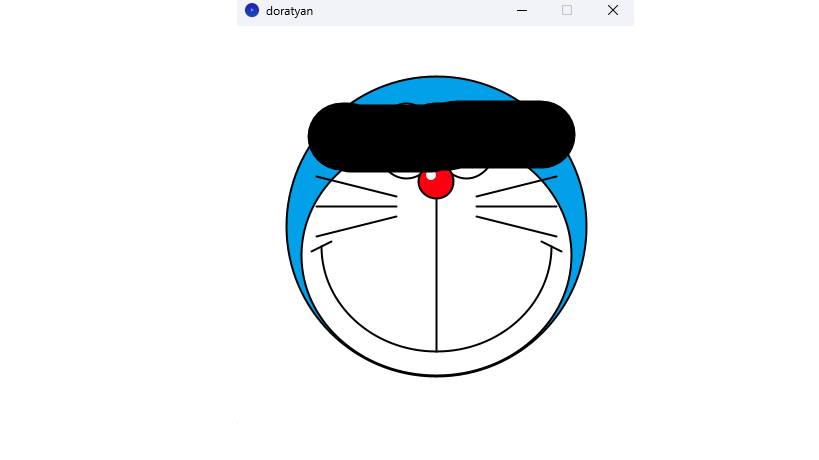

# 課題タイトル
ドラちゃん

---

## 学籍番号・氏名
- 学籍番号：2501016
- 氏名：藤澤泰心

---

## 課題概要
- どのような課題か簡潔に説明：図形でお絵描きをした(マウスをクリックすると顔が少し変わる)課題です。
 

---

## 使用技術・ライブラリ
- 使用言語：Processing (Java)
- 使用ライブラリ：ない

---

## 制作の工夫ポイント
- 実装や表現で工夫した点：目の光や舌を作るのを工夫したのと、マウスで顔を変えられること。

---

## 難しかった点・学んだこと
- 実装で苦労したこと：位置調整に苦労した
- この課題を通して学んだこと：半円や弧の作り方を学んだ

---

## 今後の改善・発展アイデア
- 次に取り組むとしたら改善したい点：体を作ること
- 発展アイデアや追加機能：ほかのキャラも作ったり動くようにしたい

---

## 実行方法
- Processingで開く場合：
  1. `2501016_fujisawaフォルダ` を開く
  2. `doratyan.pde` を開き「実行」ボタンを押す
---

## スクリーンショット / GIF

